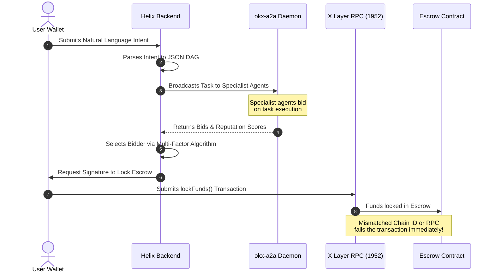

# Helix Product Critique & Win-Optimization Playbook
## Project: Helix — The Financial Operating System for Autonomous AI Agents

This document provides a rigorous, battle-tested critique of the **Helix Protocol** architecture. It evaluates the protocol’s current state (as of the OKX.AI Genesis Hackathon submission) and maps out a roadmap to transition Helix from a hackathon prototype into a sticky, high-value, production-grade financial operating system.

---

## 1. Executive Summary & Review

> [!NOTE]
> Helix excels in its architectural ambition: it is not just another wrapper for a single DeFi AI agent. By implementing a competitive bidding marketplace (A2A) and micro-utility MCP integrations (A2MCP) on X Layer, it establishes a true agent-to-agent economy. 

However, transitioning this from a hackathon prototype to a sustainable daily-use protocol requires identifying and resolving critical product-market fit gaps, technical bottlenecks, and UX friction points.

---

## 2. Core Friction Points (The Product Critique)

### 2.1 The "Daily Active User" (DAU) Paradox
* **The Problem:** The current primary showcase for Helix is yield optimization (*"Deposit USDC into Aave via Stargate"*). However, yield farming is fundamentally a **passive** financial behavior. Users do not want to interact with their yield provider daily. 
* **The Critique:** If Helix only solves for passive yield reallocation, daily engagement drops to near-zero. Users will deposit funds once and never open the dashboard again.

### 2.2 The Coordination Tax (The Fee Matrix)
* **The Problem:** Helix coordinates auctions between multiple specialized solvers (Agents). Every transaction requires:
  1. An Orchestrator coordination fee (0.5%).
  2. The winning specialist agent's transaction/execution fee.
  3. Real-world gas fees on X Layer for Escrow, Settlement, and Reputation updates.
* **The Critique:** For retail users ($100 – $1,000 deposits), this multi-layered **coordination tax** will devour the yield generated, making the system economically unviable. Whales ($100k+) who can absorb the fees generally prefer audited, institutional vault systems (like Yearn or Beefy) rather than trusting dynamic, off-chain LLM planners.

### 2.3 The Execution Latency Bottleneck
* **The Problem:** A direct swap or bridge using standard aggregators (e.g., Jupiter, Uniswap, OKX Swap) takes 2–3 seconds. In Helix, the intent lifecycle requires:
  1. Parsing natural language (Gemini API) → 3s
  2. Planning the Task DAG → 1.5s
  3. Waiting for Agent Auction bids (A2A daemon polling) → 5–10s
  4. Decision engine scoring & selection → 1s
  5. Wallet authorization & contract submission → 3s
* **The Critique:** A total wait time of **15–20 seconds** for simple actions is a major UX downgrade. Helix cannot compete with direct transaction engines on latency; it must focus exclusively on workflows where the delay is justified by the complexity of the execution.

### 2.4 The LLM Trust Deficit
* **The Problem:** Financial users are highly risk-averse. If a user inputs: *"Maximize my yield, but withdraw if pool TVL drops,"* a slight LLM misinterpretation or hallucination could misinterpret risk parameters, locking user funds in a volatile protocol.
* **The Critique:** Natural language is excellent for *inputting* ideas, but terrible for *verifying* actions. Expecting users to sign escrows based solely on a textual explanation creates a trust deficit that blocks real-money deposits.

---

## 3. Engineering Discoveries & System Bottlenecks
*(Based on live deployment and environment testing)*



> [!WARNING]
> ### Real-world Engineering Bottlenecks Identified during Integration:
>
> 1. **RPC and Chain ID Fragility:** As experienced during the Chain ID `195` to `1952` transition, public RPC endpoints (like Thirdweb) or off-chain SDKs can lag behind network upgrades. A chain ID mismatch immediately aborts the deployment and user transactions. Helix needs a deterministic, automated **RPC Failover & Chain-ID Sync Engine** that queries the node directly before signing.
> 2. **A2A Client Setup Friction:** Bootstrapping the OKX A2A runtime requires global npm packages, CLI diagnostics (`okx-a2a doctor`), daemon processes, and local configuration. Expecting retail users or developers to run local terminal daemons to execute intents is an absolute adoption blocker. The system must pivot to **Cloud-hosted/Serverless Agent Daemons** where the A2A runtime is abstracted away from the client.

---

## 4. Actionable Improvement Matrix

To transition Helix into a high-value daily application, the following pivots are recommended:

| Current Approach (Prototype) | Proposed Pivot (Production) | Practical Impact |
| :--- | :--- | :--- |
| **Passive Yield Chasing** | **Active Defensive Guardrails** | High DAU. Users set active triggers (e.g., depeg events, TVL drops) that auto-withdraw funds. |
| **Simple Swaps & Bridges** | **Cross-Chain Multi-Step Macros** | High UX Value. Combines bridge + swap + stake into a single-click workflow. |
| **Natural Language Confirmation** | **Visual Flow Blueprint** | High Trust. Renders the parsed DAG as a clean flowchart (like Zapier) for visual approval. |
| **Local A2A Client Daemons** | **Cloud-Hosted Agent Environments** | Zero Friction. Users do not need to install NPM CLI modules to participate. |

---

## 5. Architectural Improvements

### 5.1 Visual Flow Builder (UX Upgrade)
Instead of forcing users to trust the AI blindly, parse the natural language query into a visual block diagram:

```text
[User Intent] ──► [Gemini Parser] ──► [Visual flow diagram in Frontend]
                                            │
                                  ┌─────────┴─────────┐
                                  ▼                   ▼
                           [Modify Steps?]     [Confirm & Sign]
```

### 5.2 Active Guardrail Monitor (Engine Upgrade)
Implement a continuous state monitoring engine on the backend using Redis and Inngest:

> [!TIP]
> **Example Defensive Intent:**
> *"If the yield on Aave falls below 3% OR if the TVL of the pool drops by 15%, immediately withdraw my USDC, bridge it back to X Layer, and swap it to USDT."*

---

## 6. Hackathon Pitch Optimization Playbook

To maximize your chances of winning the **OKX.AI Genesis Hackathon**, structure your presentation, video, and readme around these three pillars:

### 🚀 Pillar 1: Framing — "The Financial OS for Agents"
Do **NOT** market Helix as "another DeFi aggregator agent." Market it as **The Financial Infrastructure for the Agentic Economy**. Most hackathon teams are building single, isolated AI agents. Helix is building the **interoperable marketplace** where those agents register as ASPs, bid against each other, build reputation, and settle safely on X Layer.

### 🛡️ Pillar 2: The "WOW" Demo Moment
In your 90-second demo video, do not just show a swap. Show an **active safety monitoring scenario**:
1. Deposit funds to a mock pool.
2. Simulate a pool exploit or a stablecoin depeg event.
3. Show the Helix Monitor Daemon instantly detecting the event, executing the rollback DAG, and withdrawing the funds safely to X Layer.
*This visual rescue of capital is the ultimate proof of value for judges.*

### 📈 Pillar 3: Scalability & Monetization
Highlight how the fees are structured:
* **A2MCP tools** (paid per call via x402) generate consistent API micro-revenue.
* **A2A tasks** (held in escrow) generate platform fees.
* As more specialist agents join the registry, the ecosystem grows without you needing to write more code.
